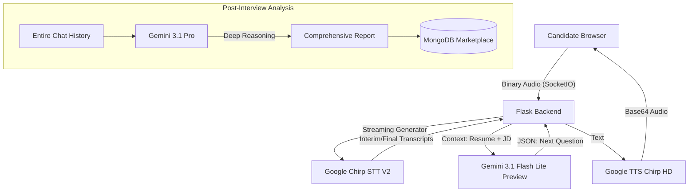

# 🎙️ Interview Simplify: The AI-Powered Technical Interviewer

### *Empowering the next generation of hiring with zero-latency, human-like voice intelligence.*

-----

## 🪝 The Hook

**Recruiting doesn't sleep—why should your interviewers?** Traditional technical screening is expensive, prone to human bias, and slows down the hiring funnel by weeks. **Tara** is a real-time, voice-first AI interviewer that conducts deep-dive technical sessions, analyzes candidate responses with senior-level reasoning, and delivers comprehensive reports—instantly.

-----

## 🚀 Startup Vision

### **The Problem**

  * **Scalability:** Startups and enterprises can't interview 1,000 candidates manually in a week.
  * **Latency:** Standard AI chat feels robotic and slow.
  * **Context Gap:** Most screening tools don't actually "read" the candidate's resume or the job description during the chat.

### **The Solution**

Tara provides a seamless, bi-directional voice interface. By utilizing **Google Chirp (STT V2)** for accent-robust listening and a **Tiered Gemini Intelligence** model, Tara understands not just what a candidate says, but the technical depth behind it.

### **The Uniqueness**

  * **Proactive Stream Reset:** Unlike standard implementations, Tara manages Google's 5-minute STT timeout proactively, ensuring long-form technical deep dives never cut off.
  * **Tiered LLM Strategy:** Uses Gemini 3.1 Flash Lite Preview for \<3s conversation latency and Gemini 3.1 Pro for post-interview forensic analysis.
  * **Multimodal PDF Alignment:** Automatically fetches and extracts JD and Resume data to ensure every question is relevant to the specific role.

-----

## 🏗️ Architecture Diagram



-----

## 🛠️ Detailed Explanations

### **1. Real-Time Audio Pipeline**

Built on **Flask-SocketIO**, the system bypasses the "Request-Response" delay of traditional REST APIs.

  * **Frontend:** Captures 16kHz Mono PCM audio via `AudioWorklet`.
  * **`StreamingAudioProcessor`:** A custom Python class that manages a persistent thread for speech recognition. It uses a `restart_lock` mechanism to handle network jitters without losing the session state.

### **2. Tiered Intelligence Layer**

  * **Conversational Layer (Gemini 3.1 Flash Lite Preview):** Optimized for speed. It processes the last 8 turns of conversation to maintain context while keeping the "Thinking" time under 800ms.
  * **Analytical Layer (Gemini 3.1 Pro):** Optimized for reasoning. It generates the `prescreeningreport` by cross-referencing candidate answers against the "Must-Have" skills listed in the MongoDB `contests` collection.

### **3. Robust Speech Infrastructure**

  * **STT V2 (Chirp):** Specifically initialized in `us-central1` to access Google’s latest Universal Speech Model, capable of handling 100+ languages and diverse accents with high accuracy.
  * **Custom Transcript Cleaning:** A regex-based post-processor that fixes common phonetic "hallucinations" in technical terms (e.g., correcting "react js" to "React").

-----

## 🚦 Getting Started

### **Prerequisites**

  * Python 3.10+
  * MongoDB Atlas Account
  * Google Cloud Service Account (with Speech-to-Text V2 and TTS enabled)

### **Environment Setup**

Create a `.env` file in the root directory:

```env
GEMINI_API_KEY=your_key_here
MONGODB_URI=your_mongodb_connection_string
GOOGLE_APPLICATION_CREDENTIALS=./your-service-account.json
GOOGLE_CLOUD_PROJECT=your-project-id
```

### **Installation**

1.  **Clone the repo:**
    ```bash
    git clone https://github.com/JanaviSingh/Interview-Simplify.git
    cd Interview-Simplify
    ```
2.  **Install dependencies:**
    ```bash
    pip install -r requirements.txt
    ```
3.  **Run the server:**
    ```bash
    python app.py
    ```

-----

## 📊 Feature Roadmap

  - [x] Real-time bi-directional voice streaming.
  - [x] Automated JD & Resume PDF text extraction.
  - [x] Dynamic JSON-based interview reporting.

-----

## 👩‍💻 Authors

**Janavi Singh** *Final Year B.Tech Student | AI-ML Engineer Intern* [LinkedIn](https://www.linkedin.com/in/janavi-singh/) | [Portfolio](https://janavisingh.vercel.app/)

-----
