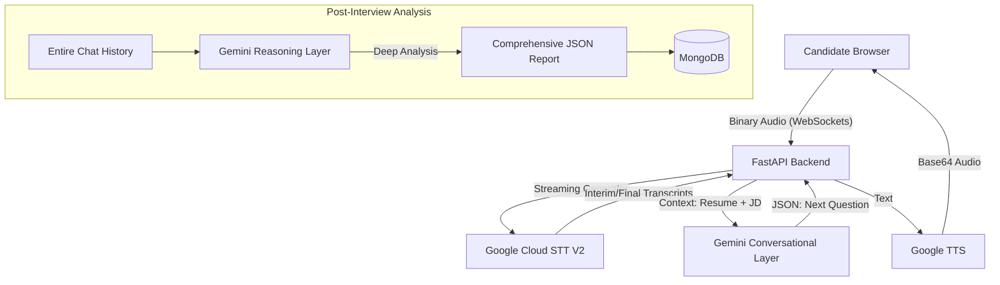

```markdown
# 🎙️ Interview Simplify: The AI-Powered Technical Interviewer


### *Empowering the next generation of hiring with zero-latency, human-like voice intelligence.*

---

## 🪝 The Hook
**Recruiting doesn't sleep—why should your interviewers?** Traditional technical screening is expensive, prone to human bias, and slows down the hiring funnel by weeks. Scaling technical interviews usually means sacrificing quality or relying on rigid, pre-recorded questionnaires.

Interview Simplify changes the paradigm. Meet **Tara**, a fully autonomous, real-time conversational AI interviewer that parses resumes, conducts deep-dive live technical Q&A, analyzes candidate responses with senior-level reasoning, and delivers comprehensive reports—instantly.

---

## 🚀 Startup Vision & Problem Statement

### **The Problem**
* **The Interview Bottleneck:** Senior engineers and recruiters spend hundreds of hours doing top-of-funnel technical screening. Startups and enterprises simply can't interview 1,000 candidates manually in a week.
* **The "Robot" Problem:** Existing AI interview tools feel scripted. They don't ask dynamic follow-up questions based on the candidate's specific answers.
* **The Latency vs. Accuracy Trap:** Standard Voice AI struggles heavily with the Indian context—specifically Hinglish, complex technical jargon (e.g., "LSTM", "NextJS"), and heavy accents. Utilizing massive Foundation Models solves the accuracy issue but introduces conversation-breaking latency (3 to 5 seconds).

### **The Solution**
Interview Simplify provides a seamless, bi-directional voice interface that perfectly balances conversational UX with deep technical evaluation. By utilizing **Google Chirp (STT V2)** for accent-robust listening and a **Tiered Gemini Intelligence** model, Tara understands not just *what* a candidate says, but the technical depth behind it.
* **Context-Aware:** Automatically fetches and extracts JD and Resume PDF data to ensure every question is relevant to the specific role and candidate's background.
* **Real-Time Streaming:** Utilizes WebSockets and the Web Audio API for continuous, chunked audio streaming (100ms intervals) to bypass traditional REST API delays.
* **Dynamic Adaptation:** Evaluates answers on the fly. If a candidate gives a shallow answer, the AI autonomously generates a dynamic follow-up question to probe deeper.

### **The Uniqueness**
* **Proactive Stream Reset:** Unlike standard implementations, Tara manages Google's 5-minute STT timeout proactively, ensuring long-form technical deep dives never cut off.
* **Tiered LLM Strategy:** Uses Gemini Flash for <3s conversation latency (processing the last 8 turns of context) and Gemini Pro for deep, post-interview forensic analysis.
* **Smart Silence Detection:** Uses `AudioContext` and `AnalyserNode` to detect when the candidate has finished speaking, automatically stopping the stream and passing the floor back to the AI.

---

## 🏗️ System Architecture

1.  **Recruiter Portal:** Uploads Job Description and Candidate Resume (PDF/Docx).
2.  **Document Parsing (Gemini Pro):** Extracts skills, experience, and generates a tailored technical question pool.
3.  **Candidate Invitation:** Automated email workflow sends a secure, unique interview link to the candidate via SMTP.
4.  **Live Interview Room (WebSocket):**
    * **Candidate Speaks:** Browser captures 16kHz Mono PCM audio via `AudioWorklet` and streams WebM Opus audio chunks via WebSockets to the FastAPI backend.
    * **Speech-to-Text (STT):** A custom Python `StreamingAudioProcessor` manages a persistent thread for Google Cloud STT V2 transcription.
    * **AI Evaluation:** Gemini evaluates the answer against an ideal rubric and generates the next question (or a dynamic follow-up).
    * **Text-to-Speech (TTS):** Google Cloud TTS synthesizes Tara's voice and streams Base64 audio back to the candidate's browser.
5.  **Post-Interview Analytics:** Gemini Pro performs deep reasoning on the entire chat history to generate a detailed JSON report with tech-stack scoring, strengths, weaknesses, and a hire/no-hire recommendation, which is then saved to MongoDB.



---

## 🔬 The Speech-to-Text (STT) Architecture Matrix
Building a fluid voice AI required rigorous empirical testing across Google Cloud's Universal Speech Models (USM) to find the perfect balance between network ping, compute latency, and contextual accuracy. 

Here is the engineering breakdown of the model evolution within this project:

| Model Version | Hosted Region | Network Ping | Est. UI Latency | Accuracy & Localization Profile | Verdict for Real-Time AI |
| :--- | :--- | :--- | :--- | :--- | :--- |
| **Chirp** | `us-central1` | ~60ms | 1.5 - 2 seconds | **High.** Great for Indian English (`en-IN`). Built-in SNR noise filtering. | maintains natural conversational flow.| **🏆 The Production Winner.** The instant word-by-word UI feedback heavily outweighs minor grammatical errors for the user experience. |

---

## ✨ Key Features
* **Resume & JD Parsing:** Extracts entities, skills, and missing keywords to build a tailored interview rubric.
* **Real-Time WebSockets:** Bi-directional audio chunking prevents HTTP overhead and ensures continuous connection.
* **Smart Silence Detection:** Client-side detection automatically stops recording when the candidate finishes answering.
* **Automated Email Workflows:** SMTP integration to seamlessly invite candidates via generated session links.
* **Comprehensive Evaluation Dashboard:** Generates a final JSON report featuring an overall score, tech-stack breakdown, key strengths, weaknesses, and a hire/no-hire recommendation.

---

## 🛠️ Technology Stack
* **Backend:** Python, FastAPI, WebSockets, Asyncio
* **AI/LLM:** Google Gemini Pro & Flash, Google Cloud TTS, Google Cloud STT V2
* **Frontend:** HTML5, CSS3, Vanilla JavaScript, Web Audio API, MediaRecorder API
* **Database:** MongoDB (PyMongo)

---

## 🚦 Getting Started

### **1. Prerequisites**
* Python 3.10+
* A Google Cloud Platform (GCP) Account with `$300` free credits (Speech-to-Text V2 and TTS enabled).
* A Gemini API Key.
* MongoDB (Local or Atlas).

### **2. Clone the Repository**
```bash
git clone [https://github.com/JanaviSingh/Interview-Simplify.git](https://github.com/JanaviSingh/Interview-Simplify.git)
cd Interview-Simplify
```

### **3. Setup Virtual Environment**
```bash
python -m venv myenv
source myenv/Scripts/activate  # On Windows
# source myenv/bin/activate    # On Mac/Linux
```

### **4. Install Dependencies**
```bash
pip install -r requirements.txt
```

### **5. Environment Variables**
Create a `.env` file in the root directory and add the following:
```env
GOOGLE_CLOUD_PROJECT=your-gcp-project-id
GOOGLE_APPLICATION_CREDENTIALS=path/to/your/gcp-service-account.json
GEMINI_API_KEY=your-gemini-api-key
MONGO_URI=mongodb://localhost:27017/
SMTP_EMAIL=your-email@gmail.com
SMTP_PASSWORD=your-app-password
```

### **6. Run the Server**
```bash
uvicorn main:app --reload
```
Navigate to `http://localhost:8000/` to access the Employer Dashboard and create your first interview campaign!

---

## 📊 Feature Roadmap
- [x] Real-time bi-directional voice streaming.
- [x] Automated JD & Resume PDF text extraction.
- [x] Dynamic JSON-based interview reporting.

---

## 👨‍💻 Author

**Janavi Singh** *Final Year B.Tech Student | AI-ML Engineer Intern* * Passionate about building low-latency, full-stack AI/ML applications.

[LinkedIn](https://www.linkedin.com/in/janavi-singh/) | [Portfolio](https://janavisingh.vercel.app/)
```
